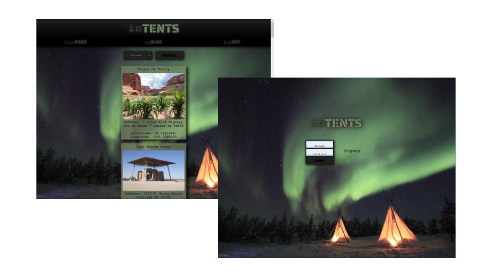

# inTENTX


 ## Table of Contents.
 * [Overview](#overview)
 * [Design](#overview)
 * [Criteria](#given-criteria)
 * [Questions](#have-questions)
 * [Links](#links)
 ---


## Overview 

create a MERN stack single-page application that works with real-world data to solve a real-world challenge, with a focus on data and user demand. 

AS A USER
I WANT to search for a national park
SO THAT I can save that park to my account
I WANT to create a blog post for a park
SO THAT I can review that particular park


## Design



---
## Given Criteria
* Use React for the front end.

* Use GraphQL with a Node.js and Express.js server.

* Use MongoDB and the Mongoose ODM for the database.

* Use queries and mutations for retrieving, adding, updating, and deleting data.

* Be deployed using Heroku (with data).

* Have a polished UI.

* Be responsive.

* Be interactive (i.e., accept and respond to user input).

* Include authentication (JWT).

* Protect sensitive API key information on the server.

* Have a clean repository that meets quality coding standards (file structure, naming conventions, best practices for class and id naming conventions, indentation, high-quality comments, etc.).

* Have a high-quality README (with unique name, description, technologies used, screenshot, and link to deployed application).


---
## Have Questions
### You can contact us at:

 <https://github.com/ZacharyWK>
 
 <https://github.com/Adaspeaks>
 
 <https://github.com/rcuevas17>
 
 <https://github.com/paynekerz>


---
## Links
[https://github.com/ZacharyWK/i-n-t-e-n-t-s](https://github.com/ZacharyWK/i-n-t-e-n-t-s)
```
https://github.com/ZacharyWK/20210729-react-portfolio-zk
```

[DEPLOYED](https://i-n-t-e-n-t-s.herokuapp.com/)
```
https://i-n-t-e-n-t-s.herokuapp.com/
```
